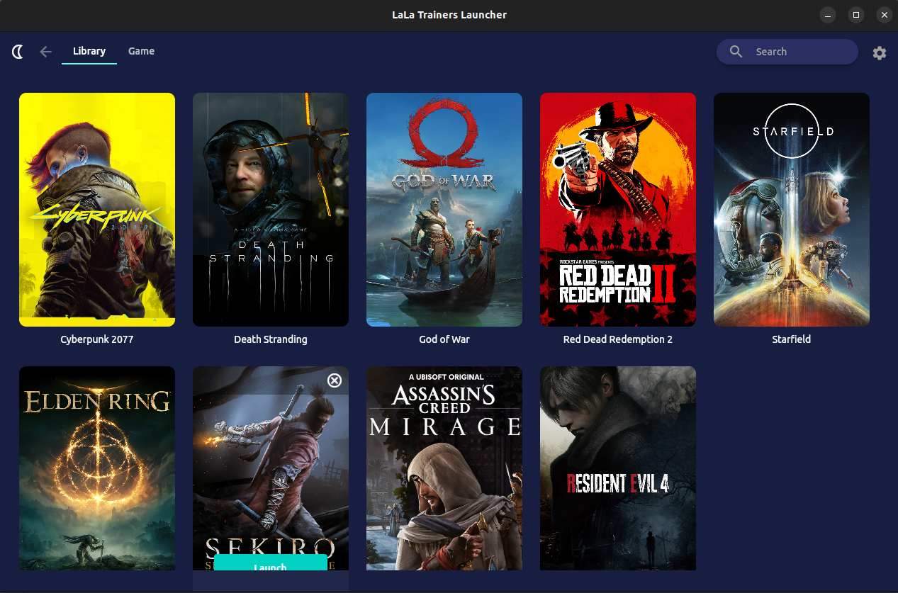
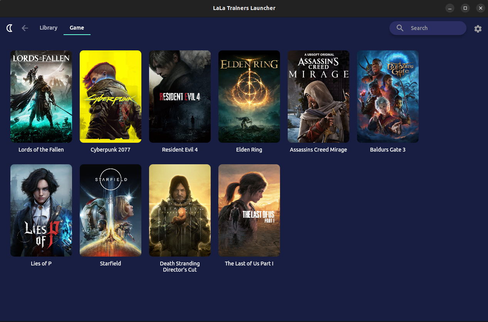
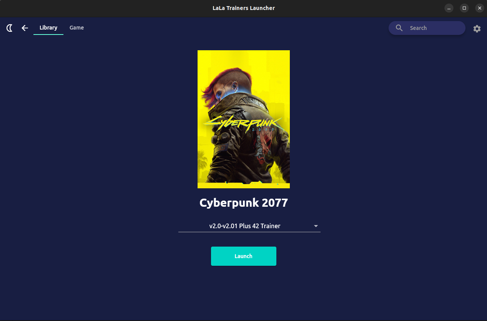

<div align="center">
  
  <h1>LaLa Trainers Launcher</h1>
  <div>
    
    
    
  </div>
    <div>
    
    
  </div>
  Ein kostenloser und plattformübergreifender Trainer-Launcher zur Verbesserung Ihres Spielerlebnisses🤗.
</div>

# 👀 Screenshots
<div align="center">
  
  
  
</div>

## 💻 Unterstützte Plattformen
* Windows
* Linux
* Steam Deck
* macOS (Beta)

## 💬 Discord
Bei Fragen einfach vorbei schauen🤗 (English).

[](https://discord.gg/5vpz2V3wB9)

## ⚙️ Installation
Sie können vorgefertigte Binärdateien direkt von [**GitHub releases**](https://github.com/wyyadd/LaLa/releases) oder [**BiliBili**](https://www.bilibili.com/read/cv27455416) herunterladen.
- Für Windows-Benutzer installiere die **exe**-Datei direkt.
- Für Linux-Benutzer führen Sie zur Installation die folgenden Befehle aus.
    ```bash
    sudo dpkg -i LaLa_linux_amd64.deb
    or
    sudo apt install ./LaLa_linux_amd64.deb
    or
    flatpak install --user LaLa_linux_amd64.flatpak
    or
    run LaLa_linux_amd64.AppImage directly🥰
    ```
- Für Steam Deck-Benutzer führen Sie zur Installation die folgenden Befehle aus.
    ```bash
    flatpak install --user LaLa_linux_amd64.flatpak
    or
    run LaLa_linux_amd64.AppImage directly🥰
    ```

## ⚠️ Wichtiger Hinweis für Linux-Benutzer
Der LaLa Launcher für Linux basiert auf [**Proton**](https://github.com/ValveSoftware/Proton), um Trainer auszuführen. Um Trainer einzusetzen, müssen Sie:
- Steam installieren und Proton einrichten.
- Das Spiel installiert haben.

Für Benutzer, die [Flatpak Steam](https://flathub.org/apps/com.valvesoftware.Steam) verwenden, müssen Sie außerdem:
- Die AppImage LaLa als nicht Steam Spiel hinzufügen
- „IN_FLATPAK_STEAM=1 %command% --appimage-extract-and-run“ als LaLas Startoption verwenden.
- Öffnen Sie LaLa über Steam.

## 🙋 FAQ
### Während der Installation gibt mein Betriebssystem eine Sicherheitswarnung aus.
LaLa Trainers Launcher ist eine Open-Source-Software, die mit Flutter entwickelt wurde. Jede Sicherheitswarnung, die Sie während der Installation sehen, ist ein Fehlalarm Ihres Systems. Sie können bedenkenlos mit der Installation fortfahren.

### Sind die vom LaLa Trainers Launcher heruntergeladenen Trainer sicher?
Die meisten von LaLa Trainers Launcher verwendeten Trainer stammen von [**Fling Trainers**](https://flingtrainer.com).
Obwohl alle Anstrengungen unternommen werden, um ihre Sicherheit zu gewährleisten, verwenden Sie sie bitte **verantwortungsvoll** und seien Sie sich bewusst, dass die Verwendung von Trainern Risiken bergen kann.

### Wo werden die Cache-Daten von LaLa Trainers Launcher gespeichert?
Unter Windows befinden sich die Cache-Daten im Verzeichnis „%LOCALAPPDATA%/com.aironheart.lala“.
Unter Linux ist es entweder in „$XDG_CACHE_HOME/com.aironheart.lala“ oder „~/.cache/com.aironheart.lala“ zu finden.

### Warum starten einige Trainer unter Linux oder Steam Deck nicht?
Dies ist ein Problem im Zusammenhang mit .Net-Abhängigkeiten. Weitere Informationen finden Sie in [dieser Ausgabe](https://github.com/madewokherd/wine-mono/issues/167).
**Vorübergehende Lösung**: [dotnet40 neu installieren](docs/reinstall_dotnet40.md).

### Warum flackern einige Trainer im Linux- oder Steam Deck-Gaming-Modus ständig?
Dies ist ein Problem im Zusammenhang mit Wayland. Weitere Informationen finden Sie in [dieser Ausgabe](https://github.com/wyyadd/LaLa/issues/6).
**Vorübergehende Lösung**: Wechseln Sie von Wayland zu X11 oder [Virtual Desktop aktivieren] (docs/enable_virtual_desktop.md).

### Warum heißt es LaLa Trainers Launcher?
Es ist nach meiner Liebe zum Film „La La Land“ benannt. Ich wünsche Ihnen viel Spaß mit der Software.💃🏽

## ☕ Unterstützung
Server sind nicht kostenlos und die Ausführung/Wartung dieses Projekts ist auch nicht kostenlos😢.
Wenn Sie mich unterstützen möchten, können Sie [**mir einen Kaffee spendieren**](https://ko-fi.com/LaLaLauncher).
Sie können auch meine KI-App ausprobieren: [**AironHeart**](https://www.aironheart.com/).
<p align="center">
	
</p>

