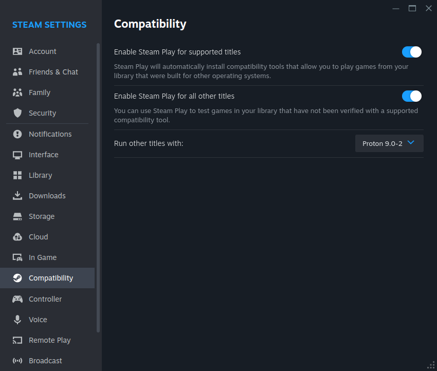
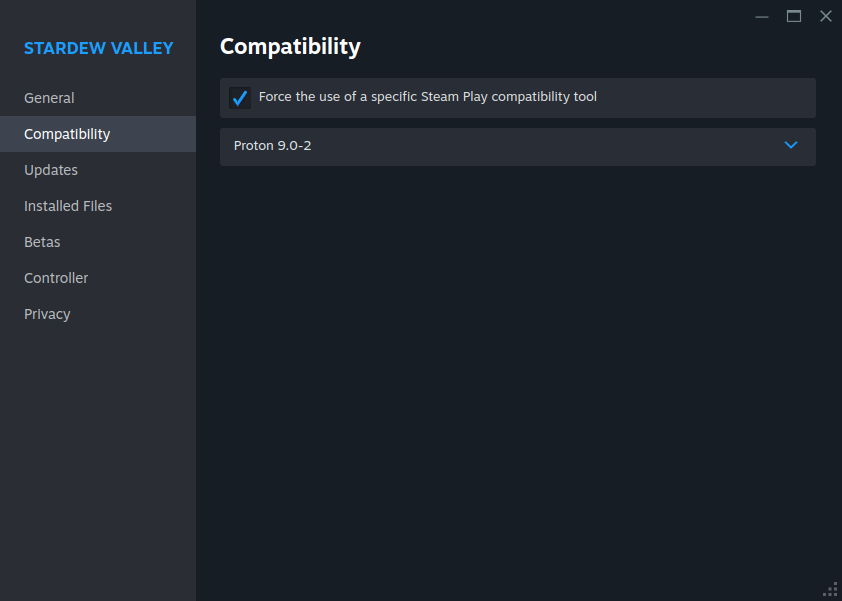

# How to set up Proton for steam
#### To turn it on, go to Settings > Compatibility > Select your version of Proton.  

# How to force the game to use Proton
Sometimes the game has a Linux version, e.g., Stardew Valley and Portal 2.  
To use trainers, you have to force the game to use Proton.  
#### Go to game Settings > Compatibility > Force the use of a compatibility tool.

