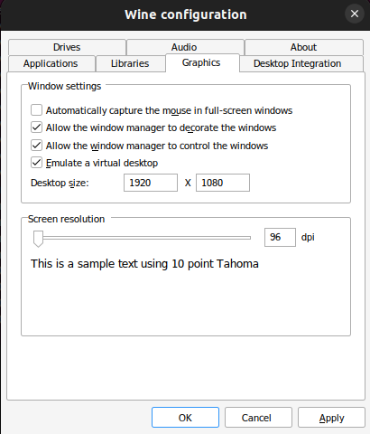

# How to enable virtual desktop using Winetricks? 
## Step1: Install Wine and Winetricks
Before proceeding, make sure you have [Wine](https://www.winehq.org/) and [Winetricks](https://github.com/Winetricks/winetricks) installed on your system.
## Step2: Open winecfg
Run the following command to open winecfg.  
Replace {APPID} with the game ID. ([How to get appID](how_to_get_appid.md))  
```bash
WINEPREFIX=~/.steam/steam/steamapps/compatdata/{APPID}/pfx winecfg
```
## Step3: Enable Virtual Desktop
Navigate to the **Graphics** tab.  
Check the "**Emulate a virtual desktop**" option and select your preferred desktop size.  
Click **Apply**.  

## Step 4: Restart the Game and Trainer
After enabling virtual desktop, restart the game and trainer.  
You should now be able to launch them successfully.
