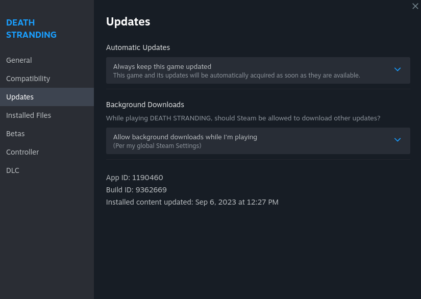
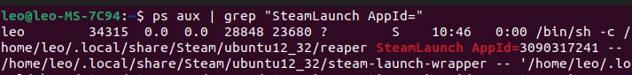

# How to get AppID?
## For steam games
1. Navigate to the game in your library and open the **Properties** menu.
2. Go to the Updates tab.
3. Now you can see your game’s **App ID** in the middle section near the bottom.  


## For non-steam games
The simplest way to obtain it is by running the game and then using the following command: 
```bash
ps aux | grep "SteamLaunch AppId="
```

